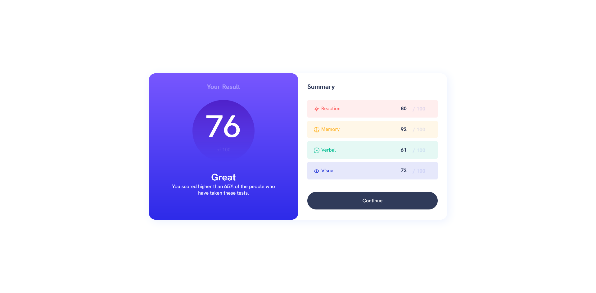
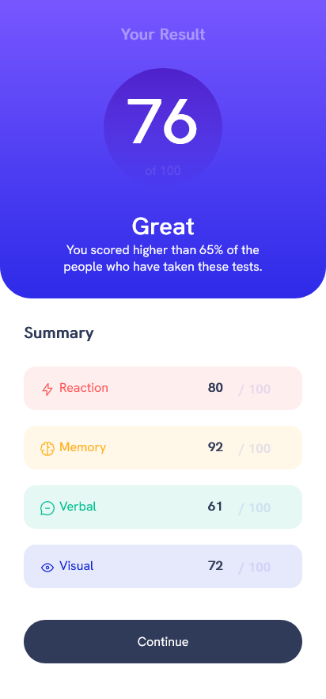

# Result summary

[Design preview for the Product preview card component coding challenge](./readme/result-preview.jpg).

## Table of contents

- [Overview](#overview)
  - [The challenge](#the-challenge)
  - [Screenshot](#screenshot)
  - [Links](#links)
- [My process](#my-process)
  - [Built with](#built-with)

## Overview

### The challenge

Users should be able to:

- View the optimal layout depending on their device's screen size
- See hover and focus states for interactive elements

### Screenshot

### Links
- Live Site URL: https://gogu69.github.io/result-summary/

## My process

### Built with

- Semantic HTML5 markup
- CSS custom properties
- Flexbox
